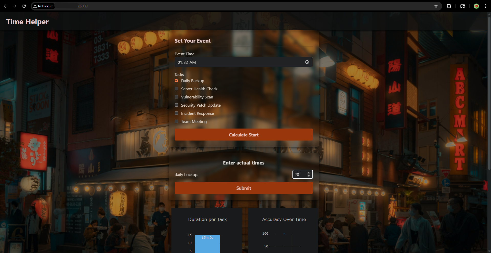
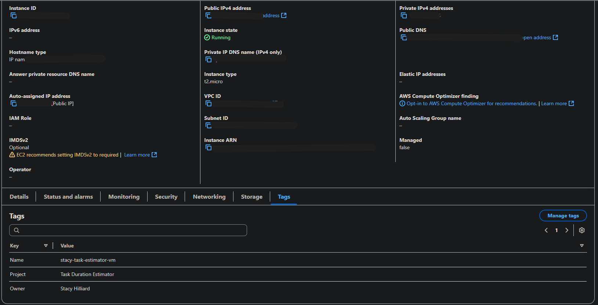

# Task Duration Estimator

## Overview

Task Duration Estimator is a Python Flask web application that predicts how long a set of tasks will take based on historical data. This repository includes the application's complete source code, and the full Infrastructure as Code (IaC) pipeline for its automated deployment to an AWS cloud environment.

The deployment automation uses Terraform to build the cloud infrastructure and Ansible to handle server configuration and application deployment.

**Live Demo:** A serverless version of this application is also deployed to Google Cloud and is available at [https://stacyhilliard.me](https://stacyhilliard.me).

**AWS Deployed Application:**

## Application Features

* **Prediction Engine:** Uses historical data to predict the total time required for a given set of tasks.
* **Dynamic Scheduling:** Recommends a task start time based on the prediction and a target event time.
* **Data Visualization:** Renders historical data and model accuracy using Plotly.js charts.
* **Interactive Timers:** Provides real-time countdowns and progress bars for tasks in progress.

## Automated Deployment Workflow

The deployment process is fully automated and located in the `/deployment` directory. It runs in two phases:

1.  **Infrastructure Creation (Terraform):**
    The `main.tf` script defines the cloud infrastructure. Running `terraform apply` builds the following resources on AWS:
    * An EC2 `t2.micro` virtual server running Ubuntu Linux.
    * An AWS Security Group to function as a firewall, allowing web (port 5000) and SSH (port 22) traffic.
    * An AWS Key Pair for secure remote SSH access.

    

2.  **Configuration & Deployment (Ansible):**
    After the infrastructure exists, the `playbook.yml` script connects to the new server to automate its configuration with the following tasks:
    * Installs system dependencies, including the Docker Engine.
    * Clones the latest version of this application from the `main` branch on GitHub.
    * Builds a Docker image from the application's `Dockerfile`.
    * Launches the application by running the new Docker container.

## Technology Stack

* **Cloud:** Amazon Web Services (AWS)
* **Infrastructure as Code:** Terraform
* **Configuration Management:** Ansible
* **Containerization:** Docker
* **Backend:** Python, Flask, Pandas
* **Frontend:** HTML, CSS, JavaScript, Plotly.js
* **Version Control:** Git & GitHub

## How to Run This Deployment

The automation scripts are located in the `/deployment` directory.

1.  **Prerequisites:** Ensure Terraform, Ansible, and the AWS CLI are installed and configured with valid AWS credentials.
2.  **Navigate to the deployment directory:** `cd deployment`
3.  **Build the infrastructure:** Run `terraform apply`.
4.  **Set up the inventory:** Create an `inventory.ini` file with the server's public IP address.
5.  **Deploy the application:** Run the `ansible-playbook` command.